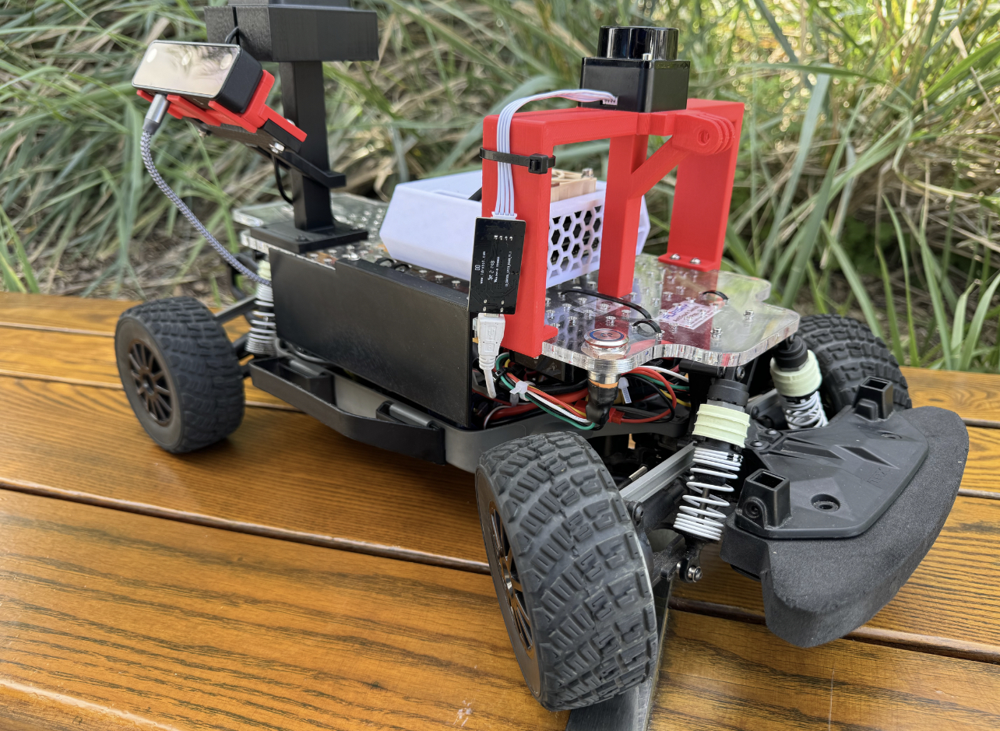

<h1 align="center">UCSDrive! Autonomous Campus Rideshare</h1>

<!-- PROJECT LOGO -->
 

  
<h3>MAE148 Final Project</h3>

Team 4 Winter 2024

<!-- TABLE OF CONTENTS -->

  
Table of Contents

  <ol>
    <li><a href="#team-members">Team Members</a></li>
    <li><a href="#final-project">Final Project</a></li>
      <ul>
        <li><a href="#original-goals">Original Goals</a></li>
          <ul>
            <li><a href="#goals-we-met">Goals We Met</a></li>
            <li><a href="#our-hopes-and-dreams">Our Hopes and Dreams</a></li>
              <ul>
                <li><a href="#stretch-goal-1">Stretch Goal 1</a></li>
                <li><a href="#stretch-goal-2">Stretch Goal 2</a></li>
              </ul>
          </ul>
        <li><a href="#final-project-documentation">Final Project Documentation</a></li>
      </ul>
    <li><a href="#robot-design">Robot Design </a></li>
      <ul>
        <li><a href="#cad-parts">CAD Parts</a></li>
          <ul>
            <li><a href="#final-assembly">Final Assembly</a></li>
            <li><a href="#custom-designed-parts">Custom Designed Parts</a></li>
            <li><a href="#open-source-parts">Open Source Parts</a></li>
          </ul>
        <li><a href="#electronic-hardware">Electronic Hardware</a></li>
        <li><a href="#software">Software</a></li>
          <ul>
            <li><a href="#embedded-systems">Embedded Systems</a></li>
            <li><a href="#ros2">ROS2</a></li>
            <li><a href="#donkeycar-ai">DonkeyCar AI</a></li>
          </ul>
      </ul>
    <li><a href="#acknowledgments">Acknowledgments</a></li>
    <li><a href="#authors">Authors</a></li>
    <li><a href="#contact">Contact</a></li>
  </ol>

<!-- TEAM MEMBERS -->
## Team Members

    
Kiersten, Jacob, Joe, Damien

<h4>Team Member Major and Class </h4>
<ul>
  <li>Kiersten - Mechanical Engineering, Ctrls & Robotics (MC34) - Class of 2025</li>
  <li>Jacob - Electrical Engineering (EC27) - Class of 2007</li>
  <li>Joe - Mechanical Engineering, Ctrls & Robotics (MC34) - Class of 2025</li>
  <li>Damien - Mechanical Engineering (MC25) - Class of 2026</li>
</ul>

<!-- Final Project -->
## Final Project

Our project goal was to develop a prototype of an a self-driving campus rideshare service exclusively for UCSD students that utilizes facial recognition as an extra element of safety and security for students. We aimed to develop ROS2 packages that would run in conjunction with the UCSD Robocar framework, programming our car to effectively perform controlled tasks while driving autonomously.

<!-- Original Goals -->
### Original Goals
- Ride Request
  - When launching this node, the user will be prompted to define 4 variables
    - `first_name`
    - `last_name` 
    - `pickup_location` 
    - `dropoff_location` 
  - This "ride-request" node will then publish these details to a topic to be accessed by additional nodes to determine the robot's subsequent actions
- Custom User Interfaces
  - This package defines custom interfaces for the parameters entered by the user
  - Stores the user input data under predefined values for our nodes to access and compare, i.e. `identiifed_face` and `first_name` of ride request
- Face Recognition
  - Facial recognition and verification nodes that will be subscribed to the "Name" message given by the user and publish to a new topic
    - Upon arriving at the pickup point, this module will deploy facial recognition using open-source Python libraries (`face_recognition, cv2, dlib`) 
    - The service will initiate a live webcam stream through a mounted Oak-D Lite and attempt to identify the student
    - If the student's identity is correctly verified as the individual who requested the ride, the navigation to dropoff will be authorized
    - If the identified student does not match the name given in the ride request, the car will cancel pickup and return to base
- GPS navigation
  - A package dedicated to extracting the pickup and dropoff locations, which will be converted to their corresponding `.csv` path datasets and used in mapping the route and navigating the path
    - Subscribes to the `pickup` and `dropoff` location topics and matches the input to a saved path such as `ebu2-to-ebu1.csv`
    - Client/Action server node structure so the driving process happens one time as a service, unlike the publisher nodes
- LiDAR
  - A package for utilizing mounted LiDAR LD06 for object detection as a safety measurement for collision avoidance
    - This should launch as a submodule as part of the overall Robocar package that runs in the background for emergency stop capabilities
   
<!-- End Results -->
### Goals We Met
- [`ride_request_publisher.py`](src/ride_request_pkg/ride_request_pkg/ride_request_publisher.py): ride request node
- [`user_input_interfaces`](src/user_input_interfaces/msg): custom interface definitions
  - [`RideRequest.msg`](src/user_input_interfaces/msg/RideRequest.msg)
  - [`RideMatch.msg`](src/user_input_interfaces/msg/RideMatch.msg)
- [`face_rec_pkg`](src/face_rec_pkg/face_rec_pkg): face recognition package
  - [`face_publisher.py`](src/face_rec_pkg/face_rec_pkg/face_publisher.py): face recognition node for publishing identified name and video stream
  - [`verification_service.py`](src/face_rec_pkg/face_rec_pkg/verification_service.py): identity verification node
  - GPS Navigation Training: DonkeyCar framework

See [`README`](src/README.md) section in our `src` directory for breakdown of how our packages run together

See [`README`](docker/README.md) section in our `docker` directory for breakdown of how to run the Docker container for our program with all dependencies built into the image

### Our Hopes and Dreams
#### Stretch Goal 1
- Complete package integration with ROS
  - We successfully trained our car in several different paths using GPS PointOneNav in DonkeyCar and storing the paths as `.csv` files
  - Unfortunately we didn't have enough time to ROS-ify the Donkey GPS framework to run them from within our ROS/Robocar modules

#### Stretch Goal 2
- LiDAR
  - If our car is driving autonomously with GPS only, we would definitely activate the LiDAR to incorporate an emergency stop
  - Object detection for collision avoidance on while driving on the pretrained GPS paths

### Final Project Documentation

* [Final Project Proposal](https://docs.google.com/presentation/d/199oVWJiOSEHAjcmizN8rejuzU7rHNCNl4qY55uGqgxQ/edit?usp=sharing)
* [Progress Update 2/29](https://github.com/kiers-neely/ucsd-mae-148-team-4/files/14469441/mae148-slides-update.pdf)
* [Progress Update 3/7](https://github.com/kiers-neely/ucsd-mae-148-team-4/files/14547470/mae148-slides-update.2.pdf)

<!-- Early Quarter -->
## Robot Design

### CAD Parts
#### Final Assembly

#### Custom Designed Parts
| Part | CAD Model | Designer |
|------|--------------|------------|
| Front Camera and LiDAR Mount |  | Kiersten
| Side Camera and GNSS Puck Mount |  | Kiersten
| Acrylic Base |  | Damien
| Side Paneling |  | Damien

#### Open Source Parts
| Part | CAD Model | Source |
|------|--------|-----------|
| Jetson Nano Case |  | [Thingiverse](https://www.thingiverse.com/thing:3778338) |
| Oak-D Lite Case |  | [Thingiverse](https://www.thingiverse.com/thing:533649) |

### Electronic Hardware
Below is a circuit diagram of the electronic hardware setup for the car.

### Software
#### Embedded Systems
To program the Jetson Nano, we accessed the Jetson Nano through remote SSH connection to an embedded Linux system onboard and ran a docker container with all the necessary dependencies to run our packages. This allowed us to eliminate any incompatibility issues and to maximize resource efficiency on the Jetson. We used a variation of virtualization softwares including VMWare and WSL2 to build, test and launch our programs. 

#### ROS2
The base image pulled from Docker Hub for our project development contained the UCSD Robocar module ran on a Linux OS (Ubuntu 20.04). The Robocar module, consisting of several submodules using ROS/ROS2, was originally developed by Dominic Nightingale, a UC San Diego graduate student. His framework was built for use with a wide variety of sensors and actuation methods on scale autonomous vehicles, providing the ability to easily control a car-like robot while enabling the robot to simultaneously perform autonomous tasks.

#### DonkeyCar AI
For our early quarter course deliverables we used DonkeyCar to train a car in driving autonomous laps around a track in a simulated environment. We used Deep Learning to record visual data of driving on a simulated track and trained the car with the data to then race on a remote server. This helped us to prepare for training our physical car on an outdoor track with computer vision.

<!-- Authors -->
## Authors
  - [@kiers-neely](https://github.com/kiers-neely)  

<!-- Badges -->

<!-- ACKNOWLEDGMENTS -->
## Acknowledgments
*Thank you to my teammates, Professor Jack Silberman, and our incredible TA Arjun Naageshwaran for an amazing Winter 2024 class!*

<!-- CONTACT -->
## Contact

* Kiersten | kneely@ucsd.edu
* Jacob | jacoberobison@gmail.com 
* Joe | hjjeong@ucsd.edu
* Damien | dcuara@ucsd.edu

