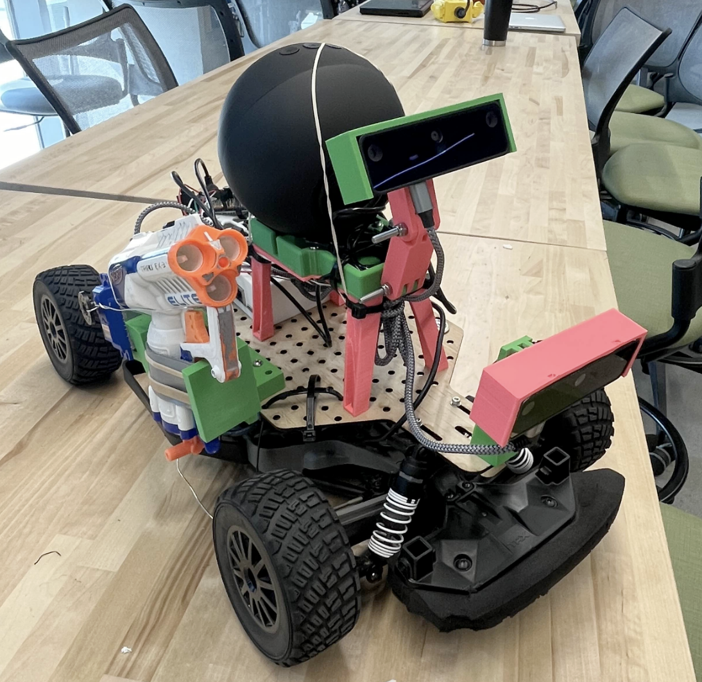
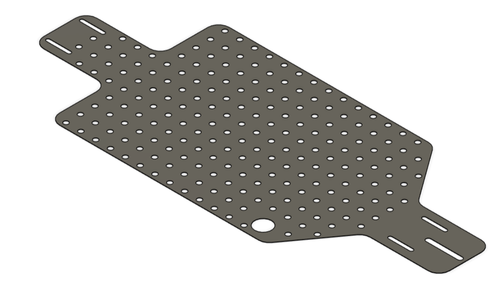
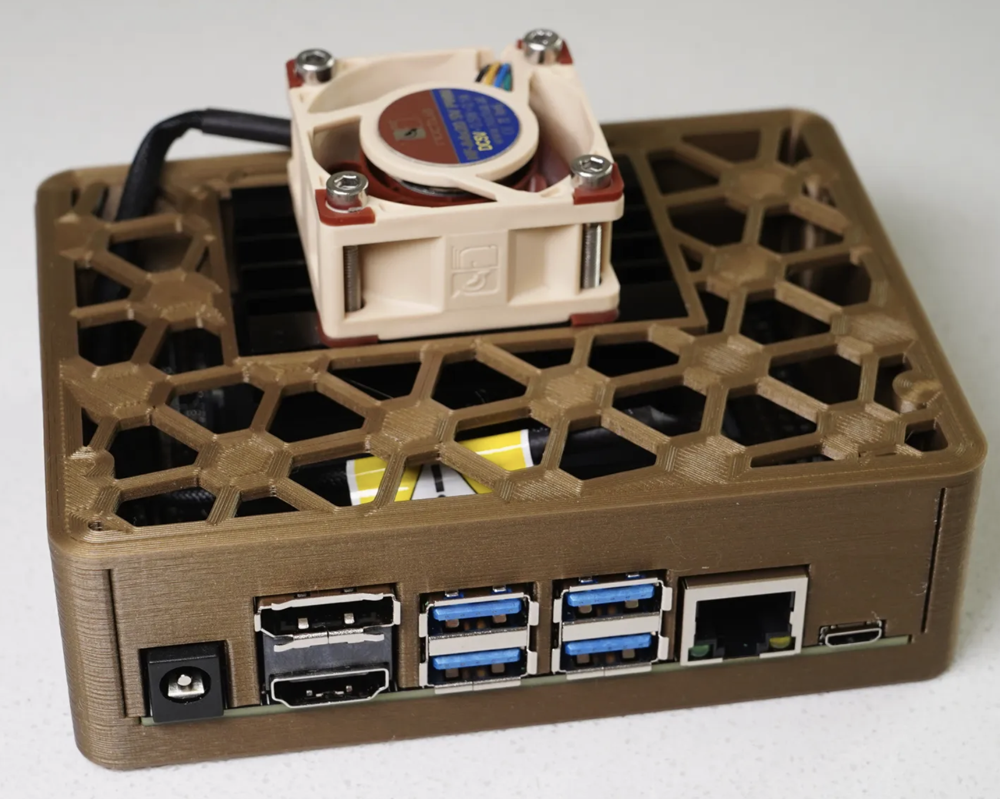

<h1 align="center">RoboGuard! Autonomous Security Guard</h1>

<!-- PROJECT LOGO -->
 

  
<h3>MAE148 Final Project</h3>

Team 2 SS02 2024

<strong>:warning: We are currently missing some ROS2 files uploaded because we forgot to pull files before diassembling robot. Page will be updated with finalized files September 16
</strong>

<!-- TABLE OF CONTENTS -->

  
Table of Contents

  <ol>
    <li><a href="#team-members">Team Members</a></li>
    <li><a href="#final-project">Final Project</a></li>
      <ul>
        <li><a href="#original-goals">Original Goals</a></li>
          <ul>
            <li><a href="#goals-we-met">Goals We Met</a></li>
            <li><a href="#our-hopes-and-dreams">Our Hopes and Dreams</a></li>
              <ul>
                <li><a href="#stretch-goal-1">Stretch Goal 1</a></li>
                <li><a href="#stretch-goal-2">Stretch Goal 2</a></li>
              </ul>
          </ul>
        <li><a href="#final-project-documentation">Final Project Documentation</a></li>
      </ul>
    <li><a href="#robot-design">Robot Design </a></li>
      <ul>
        <li><a href="#cad-parts">CAD Parts</a></li>
          <ul>
            <li><a href="#final-assembly">Final Assembly</a></li>
            <li><a href="#custom-designed-parts">Custom Designed Parts</a></li>
            <li><a href="#open-source-parts">Open Source Parts</a></li>
          </ul>
        <li><a href="#electronic-hardware">Electronic Hardware</a></li>
        <li><a href="#software">Software</a></li>
          <ul>
            <li><a href="#embedded-systems">Embedded Systems</a></li>
            <li><a href="#ros2">ROS2</a></li>
            <li><a href="#donkeycar-ai">DonkeyCar AI</a></li>
          </ul>
      </ul>
    <li><a href="#acknowledgments">Acknowledgments</a></li>
    <li><a href="#authors">Authors</a></li>
    <li><a href="#contact">Contact</a></li>
  </ol>

<!-- TEAM MEMBERS -->
## Team Members

    Matthew Huntley, Donovan Sanders, Conor Norris

<h4>Team Member Major and Class </h4>
<ul>
  <li>Matt - Electrical Engineering, Computer System Design - Class of 2025</li>
  <li>Donovan - Computer Engineering - Class of 2023</li>
  <li>Conor - Mechanical Engineering, Ctrls & Robotics - Class of 2024</li>
</ul>

<!-- Final Project -->
## Final Project

Our project goal was to develop a prototype of an autonomous security guard that patrols around a chosen perimeter and detects any people in its path. Then it checks to see if the visitor's face is on the preauthorized guest list and takes action against them if not. We developed our own ROS2 packages as well as integrating the lane detection package that came with the Robocar framework, allowing our vehicle to perform multiple complex tasks simultaneously. 

<!-- Original Goals -->
### Original Goals
- Set and follow path given patrol path 
- If a person is recognized while on the patrol path, would it will drive to the person and command them to show their face
- The user's face will be checked against a facial recognition whitelist. If they are not on the approved list, an alarm is set off. Also, if they do not show their face to the robot within a grace period the alarm is set off.

   
<!-- End Results -->
### Goals We Met
- Robocar Lane Guidance integration with a new pause service using SetBool Service type to follow yellow line path
- Custom Roboflow model to recognize humans as well as three individuals which are authorized and unauthorized running on Oak-D lite
- Roboflow ROS2 node with detection logic 
- Custom audio_player topic with subscriber node
- Using Two Oak-D Cameras to run two different machine learning models: one for Lane Detection and Following and another for Person identification. 

### Our Hopes and Dreams
#### Stretch Goal 1
- Firing Nerf gun at people after unsuccessful identity verification 
  - We were unable to get access to a powerful enough servo until the day of presentation, but otherwise accomplished this 

#### Stretch Goal 2
- Follow unauthorized individuals by publishing to /cmd_vel
  - We didn't have enough time to implement person following and instead it drives on the path while patrolling then stops when identifying and resumes it's patrol path after. 

* [Final Project Proposal](https://docs.google.com/presentation/d/16qUQfX1MIP-nKk3mGd-FVhuW9kBISMMb51jPM2vEShc/edit?usp=sharing)
* [Update Presentation](https://docs.google.com/presentation/d/1XAe-p0AtVESGOgnL7_4Y8I-bLYzD0H-fxcK1hfjJbZo/edit?usp=sharing)
* [Final Presentation](https://docs.google.com/presentation/d/14qgWDKYyoA284vqveSCneuvcSrip2JctvzqzZFwIgrg/edit?usp=sharing)

<!-- Early Quarter -->
## Robot Design

### CAD Parts
#### Final Assembly

#### Custom Designed Parts
| Part | CAD Model |
|------|--------------|
| OAKD Camera Mount |  
| OAKD Articulating Arm |  
| OAKD Plate Mount |  
| GPS Lidar Mount |  
| Nerf Gun Mount | 
| Perforated Plate |  

#### Open Source Parts
| Part | CAD Model |
|------|--------|
| Jetson Nano Case |  

### Electronic Hardware
Below is a circuit diagram of the electronic hardware setup for the car.

### Software
#### Embedded Systems
Embedded Linux: To use the Jetson nano, we had to connect via ssh so that we could run, upload, and program our robot. The provided Docker container from Dominic Nightengale had ROS2 installed so that we could easily start immediate development on our robot.

#### [Roboflow](https://universe.roboflow.com/basketballsmartref/mae148-human-identification/model/5	)
- Implemented Custom Roboflow 3.0 Object Detection Model to detect “Human-person, Conor, Donovan, Matt” which were used to create authorized and unauthorized users for the model to detect. Our model runs “on the edge of the edge” through the use of the Oak-D Lite and Nvidia Jetson Nano.
- Created basic Image Collection Script for the Oak-D lite to take training images for our model as this was how our robot would “see” in the real environment.

#### Docker and ROS2 Implementation:
The ROS2 Docker Image provided by Dominic Nightengale has several ROS2 packages that are already implemented and testable on our robot. 
- Used Robocar Lane Navigation Package 2 which makes use of the Lane Guidance node to follow a yellow line. Using this package and integrating a pause service on top of the provided code as well logic for Roboflow Model Detection and Custom Audio Subscriber Node.
- Created Custom Roboflow Package to use our model for person identification and used detections to publish to other ROS2 nodes.

### Challenges
We were initially hoping to use a custom Yolo V8 which ran locally using the Oak-D lite, however, even after much trial and error, we could not get it to run due to an invalid architecture error. We tried several different versions of our model such as the blob and onnx files, however, even after installing Ultralytics to the Docker image (to use our Yolo model), the model would still not run. Went ended up working and being faster in the end was to use the Roboflow 3.0 Object Detection Model available on the website which ported the correct version of our custom Roboflow model over to the Oak-D lite. 

<!-- ACKNOWLEDGMENTS -->
## Acknowledgments
*Thanks to Eric, Alex, and Professor Silberman*

<!-- CONTACT -->
## Contact

* Matt | mhuntley@ucsd.edu
* Conor | cpnorris@ucsd.edu 
* Donovan | dsanders@ucsd.edu

